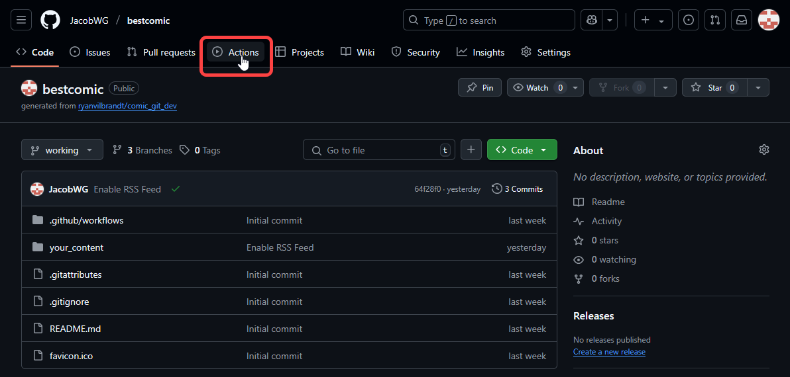
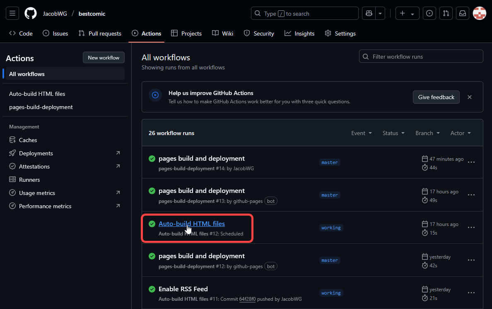
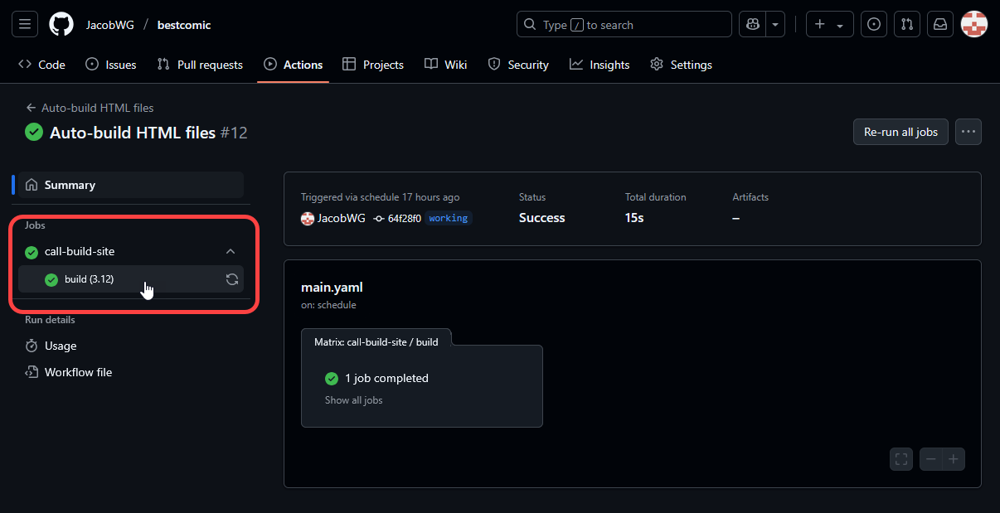
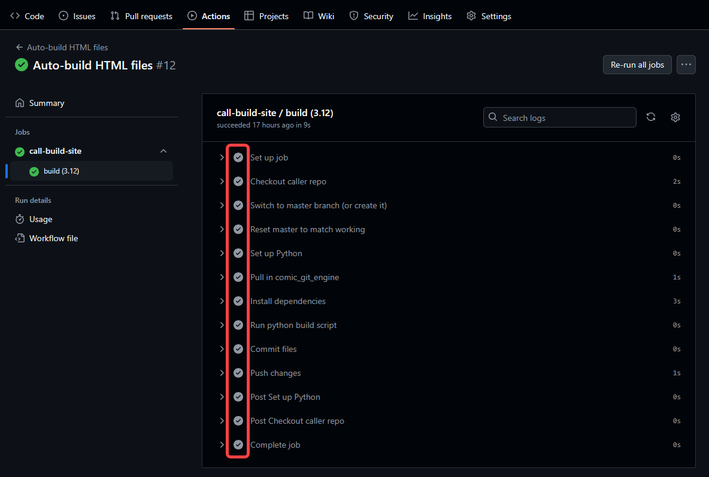
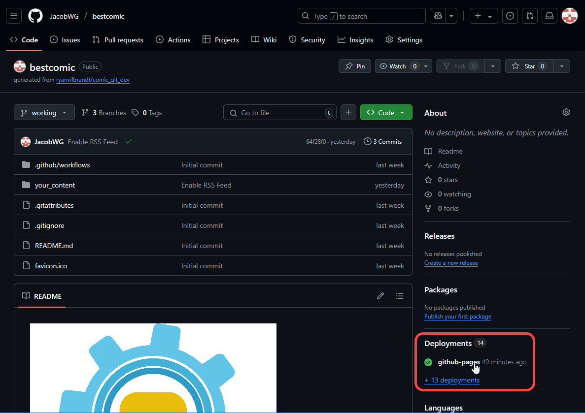
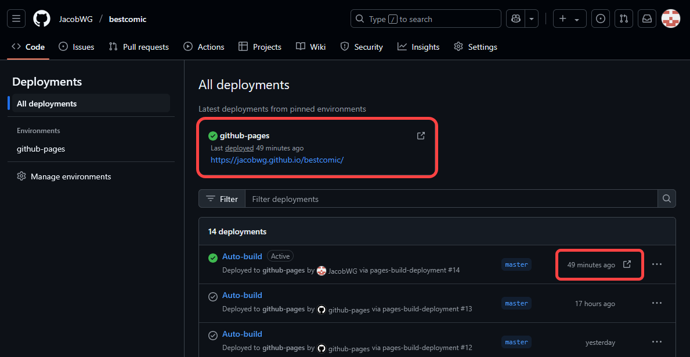

# Troubleshooting

## Checking the Progress of Your Deployment

If your website doesn't update after you push a change, there's a chance something went wrong during the deployment to GitHub. There are a few things you should do:

### Check for Errors While Building Your Site

First, go to the **Actions** tab on the main page of your GitHub repo.

<figure><figcaption></figcaption></figure>

Here, you will see all the times that GitHub attempted to build your website, each as an individual "Action". Successful Actions will have a green checkmark next to them. Actions that encountered an error will have a red X. If an Action is currently being performed, it will have a yellow, spinning circle.

To check the output logs of the most recent Action, click on its name. This will take you landing page for that particular Action.

<figure><figcaption></figcaption></figure>

Then click on **build (3.8)** to view the logs for that Action.

<figure><figcaption></figcaption></figure>

Each GitHub Action is broken into many different steps, each of which can succeed or fail, as marked by the green checkmark or red X next to each one.

<figure><figcaption></figcaption></figure>

The most common step that breaks is the _Run python build script_ step, and you can view the logs for that step by clicking on it. A failed step will have an error in it like this:

```
Traceback (most recent call last):
  File "src/scripts/build_site.py", line 440, in <module>
    main()
  File "src/scripts/build_site.py", line 419, in main
    "comic_title": comic_info.get("Comic Info", "Comic name"),
  File "/opt/hostedtoolcache/Python/3.8.3/x64/lib/python3.8/configparser.py", line 792, in get
    raise NoOptionError(option, section)
configparser.NoOptionError: No option 'Comic name' in section: 'Comic Info'
```

This is called a "Traceback" and it looks very intimidating, but the only part you should concern yourself with are the last two lines. This explains the error the script is running into, and hints at what you can do to fix it. I've provided a few common errors, their most common causes, and the recommended fix.

<table><thead><tr><th valign="top">Error</th><th valign="top">Description</th></tr></thead><tbody><tr><td valign="top">configparser.NoOptionError: No option '&#x3C;option>' in section: '&#x3C;section>'</td><td valign="top">This usually means you've accidentally deleted a line when updating your <code>comic_info.ini</code> file. Check the Editing Your Comic Info page and make sure you have all the necessary options set.</td></tr><tr><td valign="top">KeyError: '&#x3C;key>'</td><td valign="top">This is usually caused by the same issue as the above, though instead the missing option is in one of the <code>info.ini</code> files for a particular comic. Check the Adding Comic Pages page and make sure you have all the necessary options set.</td></tr><tr><td valign="top">ValueError: Not a boolean: &#x3C;value></td><td valign="top">In this case, you've set a value that should only be <code>True</code> or <code>False</code> to something else. Search your config files for the string shown in &#x3C;value> in the given error, and fix that.</td></tr><tr><td valign="top">configparser.ParsingError: Source contains parsing errors: '&#x3C;text>'<br>    [line #]: '&#x3C;text>'</td><td valign="top">You've fat-fingered something in one of your config files, usually in the space between two config sections. Check your config files for any accidental changes.</td></tr><tr><td valign="top">ValueError: time data '&#x3C;date>' does not match format '&#x3C;format string>'</td><td valign="top">You've likely pushed a comic update with a Post date that doesn't match the <code>Date format</code> option in your comic_info.ini. Or, you made a change to the same option that doesn't match one of your comic's Post dates. Either fix the format string, or fix the Post date for the comic page that's having issues.</td></tr><tr><td valign="top">ValueError: unconverted data remains: &#x3C;text></td><td valign="top">Same as above.</td></tr><tr><td valign="top">FileNotFoundError: [Errno 2] No such file or directory: 'your_content/comics/&#x3C;page name>/&#x3C;filename>'</td><td valign="top">You've either provided an incorrect Filename in one of your <code>info.ini</code> files, or forgotten to copy the comic file into that folder.</td></tr></tbody></table>

### Check if GitHub Pages Has Deployed

Every time you push a change to GitHub, a new deployment to GitHub Pages is created. Assuming your Action completed without errors (see previous subsection), if you still don't see the update on your website, it may be that the GitHub Pages deployment is just taking a while.

To check on the progress of your GitHub Pages deployment, go to the main page of your GitHub repo, and scroll down until you see the **Environments** section in the right sidebar. Click **github-pages**.

<figure><figcaption></figcaption></figure>

Here you will see a list of all the times your repo has been deployed to GitHub Pages. If your website has just updated, the top deployment in the activity log should say "now" or "a few seconds ago" or "X minutes ago". If the top deployment is older than when you last pushed a change to your repo, give it a few more minutes. Sometimes it just takes a while.

<figure><figcaption></figcaption></figure>

### Force Refresh your Browser

If you see a recent GitHub Pages deployment on this page but your website hasn't updated, it may be that your browser still has the old version cached, and you just need to force refresh your browser. The easiest way to do this is with Ctrl+F5. Otherwise, you may need to clear your browser's cache before refreshing the page.

Here are instructions on how to do that in [Firefox](https://support.mozilla.org/en-US/kb/how-clear-firefox-cache), [Chrome](https://support.google.com/accounts/answer/32050), [Internet Explorer](https://support.microsoft.com/en-us/help/17438/windows-internet-explorer-view-delete-browsing-history), and [Microsoft Edge](https://support.microsoft.com/en-us/help/10607/microsoft-edge-view-delete-browser-history).

## Check Your Published Branch

If you've doublechecked everything in the above section, verified that your website is building properly, and verified that the GitHub Pages deployment has completed, but you're still not seeing your website, it may be that you've published the wrong branch. It's especially likely this is what's happened if you're seeing comic\_git's README file when you load your website rather than a webpage.

Go through the steps in Publishing to GitHub Pages and doublecheck that you're publishing to the `master` branch and not the `working` branch.
