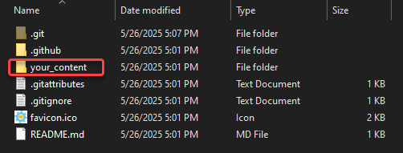
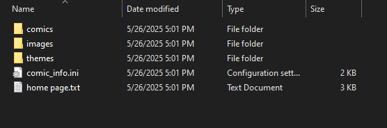

# Learning the File Structure

When uploading comic pages or making basic changes to your website in comic\_git, you usually only need to work in one directory of your repository: the :file\_folder:**your\_content** folder.

<figure><figcaption></figcaption></figure>

In :file\_folder:**your\_content**, you will see the files and folders you'll need to become acquainted with to create your website.

<figure><figcaption></figcaption></figure>

## Directories

* :file\_folder:**comics**: This is where your comic pages live, as well as the information specific to those pages. [Adding Comic Pages](adding-comic-pages.md) goes into this folder in detail.
* :file\_folder:**images**: This is where website images that aren't tied to a specific comic page live. This includes things like a banner image, navigation link images, and whatever else you may want to use. [Customizing Your Website](customizing-your-website.md) talks about this folder in more detail.
* :file\_folder:**themes**: This is where the actual design of your website lives. comic\_git comes with a preset theme in the default folder, but you can edit the default theme, add your own, or even add multiple that you can switch between.
  * Editing the default theme, which is the easiest way to get started, is covered in [Customizing Your Website](customizing-your-website.md).
  * Adding your own theme is covered in [Extra Features](../advanced-editing/extra-features.md).
  * Changing which theme is used is covered in [Editing Your Comic Info](editing-your-comic-info.md).
* :file\_folder:**site\_root**: Files placed here are copied to the root of the generated site. This is the home for files such as `favicon.ico`, `.nojekyll`, or `CNAME`. comic_git expects this folder to exist even when it is empty.

## Files

* :page\_facing\_up:**comic\_info.ini**: This is the traditional settings file for the website. Nearly everything that controls the behavior or configuration of your site lives in this file. [Editing Your Comic Info](editing-your-comic-info.md) covers it in detail. comic_git also supports an optional `comic_info.toml` alternative; see [TOML Configuration](../advanced-editing/toml-configuration.md).
* :page\_facing\_up:**home page.txt**: This is the HTML for your comic's front page. It's in a text file to make it easier to edit, and will be converted to a proper HTML file when GitHub Pages builds your website. [Customizing Your Website](customizing-your-website.md#editing-your-comics-homepage) talks about this file more.


This page shows icons next to the folders and files to help you get used to the structure. However, the rest of this documentation will simply use the direct, literal name of a folder or file, such as `your_content` or `comic_info.ini`.

