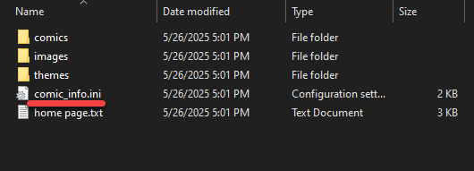

# Editing your Comic Info


**Quickstart Tip**

If you're setting up comic\_git for the first time and you just want to get started quickly without delving into all comic\_git's features, you only need to edit the [\[Comic Info\]](editing-your-comic-info.md#comic-info) and [\[Links Bar\]](editing-your-comic-info.md#links-bar) sections.


When setting up comic\_git, there are some critical things you need to do to identify your comic, like give it a name or set up what links go in the Links Bar. comic\_git also supports a few extra features that can be enabled for your project, like automatically generating thumbnails for your comic pages. All these settings can be adjusted in the :page\_facing\_up:**comic\_info.ini** file in the :file\_folder:**your\_content** folder.

<figure><figcaption></figcaption></figure>

This is a standard [.ini file](https://en.wikipedia.org/wiki/INI_file) that may be familiar to you if you've ever edited config files for other programs. If you haven't seen one before, it's just a text file with a special purpose, and you can edit it in Notepad or whichever text editor you're comfortable with.

Inside the file, the options format is very simple: The name of the option and its value, separated by an equals sign (for example, `Title = Sample Comic`). These options are also separated into sections (for example, `[Comic Info]`).


Sections are not just helpful categories; the program behind comic\_git relies on finding specific options in specific sections. If you put an option in the wrong section or change the name of an option or section, at best comic\_git will ignore it, and at worst it'll break your site. Be mindful when adding or deleting things!



Some options listed here may not be present in your comic\_info.ini file. These options are not required and may be ignored if you have no need to adjust them.


Each of the sections and their options are described in more detail below.

## **Quick Links**

* [\[Comic Info\]](editing-your-comic-info.md#comic-info)
* [\[Comic Settings\]](editing-your-comic-info.md#comic-settings)
* [\[Pages\]](editing-your-comic-info.md#pages)
* [\[Links Bar\]](editing-your-comic-info.md#links-bar)
* [\[Archive\]](editing-your-comic-info.md#archive)
* [\[Image Reprocessing\]](editing-your-comic-info.md#image-reprocessing)
* [\[RSS Feed\]](editing-your-comic-info.md#rss-feed)
* [\[Transcripts\]](editing-your-comic-info.md#transcripts)
* [\[Google Analytics\]](editing-your-comic-info.md#google-analytics)

### \[Comic Info]

Comic name

* Required
* Value: `string`: your comic name
* Default: `comic_git Example`

This is the name of your comic. The comic name shows up in the tab every time a page from your website is loaded. (for example, Page 202 - comic\_git Example). It **does not** need to match the name you gave your repository.

Author

* Required
* Value: `string`: your authorial name
* Default: `Ryan Vilbrandt`

Whatever name or credit you wish to give for the creation of your comic. It can be a single name, a list of names, a sentence, whatever you want. It's currently only used when generating your [RSS Feed](../additional-information/extra-features.md#adding-an-rss-feed).

Description

* Required
* Value: `string`: your description
* Default: `Explore a free webcomic-based static site generator delivered through GitHub!`

A short, one-sentence description of your web comic. This will show up in your [RSS feed](../additional-information/extra-features.md#adding-an-rss-feed) and [social media previews](../additional-information/extra-features.md#adding-social-media-previews).

### \[Comic Settings]

Engine version

* Required
* Value: `string`
* Default: `master`

This is used with the comic\_git\_engine to build the site.


DO NOT CHANGE THIS UNLESS YOU ARE 100% SURE YOU KNOW WHAT YOU'RE DOING. Changing this unnecessarily **will** break your site.


Date Format

* Required
* Value: `string`: date format using [Python %-substitutions](https://docs.python.org/3/library/time.html#time.strftime)
* Default: `%B %d, %Y`

This is the date format that all your comic Post dates will be in. The default format accepts dates written like `July 20, 1969`. You can change the format to any you prefer.


Be aware that you need to manually type in the date when adding a comic Post, and that date **must** match the format specified here. The format is specified here so that comic\_git knows how to order your comics chronologically based on the dates in each Post.



If you use the default format, remember to include the comma after the day!


The following table is a list of common date format strings. You can copy/paste any of these into the **Date format** option to change what date format to use in your comic files. (See [Adding Comic Pages](adding-comic-pages.md) for more info on setting the Post dates for your comics)

| Format string         | Example                   |
| --------------------- | ------------------------- |
| %B %d, %Y             | July 16, 1969             |
| %Y-%m-%d              | 1969-07-16                |
| %a, %d %b %Y %H:%M:%S | Wed, 16 Jul 1969 04:20:00 |

You can also build your own format strings if you feel comfortable doing so. Use the [list of Python %-substitutions](https://docs.python.org/3/library/time.html#time.strftime) to create your preferred date format.

Timezone

* Required
* Value: `string`: timezone in [TZ Identifier format](https://en.wikipedia.org/wiki/List_of_tz_database_time_zones#List)
* Default: `US/Pacific`

The timezone for all the dates in your comic. This is important for when comic\_git is determining when scheduled posts should be published. For example, if you push out an update at 9pm your time just before the midnight deadline, you don't want comic\_git to publish the page right away just because it's past midnight in some other timezone!

All timezones found in the TZ Identifier column on the [TZ database time zones Wikipedia page](https://en.wikipedia.org/wiki/List_of_tz_database_time_zones#List) are allowed.

Use images in navigation bar

* Required
* Value: `boolean`: `True` or `False`
* Default: `False`

When set to `true`, this will replace the First, Previous, Next, and Latest navigation links on the comic pages with the icons found in`your_content/images/navigation_icons/`. You can change which icons are used by replacing these files with your own, or keep this setting on `false` to just use text links.

Comic domain

* Optional
* Value: `string`: URL of domain
* Default: none

If you are building your website locally, and you haven't configured a custom domain, you must set this so that comic\_git knows what domain to use to build the URL to link to your comic, for the purposes of things like your RSS feed and your social media preview links. For more details, see [Building your Website on your own PC](../additional-information/advanced-tips.md#building-your-website-on-your-own-pc).

This option should include your website's entire domain, subdomain, and top-level domain. Do not include the slash at the end. You may include the "http://" or "https://" if you wish.

Examples: `http://ryanvilbrandt.github.io`, `www.tamberlanecomic.com`

Comic subdirectory

* Optional
* Value: `string`: name of GitHub repo
* Default: none

If you're building your website locally and you have not set a custom domain, you must set this to the name of your GitHub repository. This allows most of the links on your website to function properly. For more details, see [Building your Website on your own PC](../additional-information/advanced-tips.md#building-your-website-on-your-own-pc).

This option should not include leading or trailing slashes.

Examples: `comic_git`, `tamberlane`

Use https when building comic URL

* Optional
* Value: `boolean`: `True` or `False`
* Default: none

If you are building your website locally, or you've set up a custom domain, setting this to `True` will force any URLs pointing to your website to use `https://` instead of `http://`.

Theme

* Optional
* Value: `string`: name of theme folder
* Default: `default`

The name of the theme folder to use for your site. The theme folder must be located in `your_content/themes`.

Extra Comics

* Optional
* Value: `string`: see blow
* Default: none

A comma-separated list of any extra comics hosted on your site. For more information, see [Extra Comics](../additional-information/extra-features.md#extra-comics).

Banner image

* Optional
* Value: `string`: path to image
* Default: `/your_content/images/banner.png`

This option tells comic\_git where to go to find the banner image for the comic, that big image that goes at the top of every page in the default comic\_git website layout.

Auto-detect comic images

* Optional
* Value: `boolean`: `True` or `False`
* Default: `False`

By default, comic\_git relies on the `Filename` option provided in each comic's `info.ini` file to know what image file to use for the comic page (see [Adding Comic Pages](adding-comic-pages.md)). If the `Filename` is not provided in this case, comic\_git will raise an error and fail to build your website.

If this option is set to `True`, and `Filename` is missing from the comic's `info.ini` file, comic\_git will look in the comic page's directory for any image files. If it finds only one image file (aside from `thumbnail.jpg`), it will assume that is the image file it should use for the comic page. If there are no image files in the directory, or more than one image file in the directory, comic\_git will raise an error.

If you never store more than one image in a comic page's directory, this is a useful option to set, because it will save you the trouble of updating the `Filename` of your `info.ini` file every time you upload a new comic page.

If you wish to store multiple image files in a particular comic page's directory, you can define `Filename` in just that comic's `info.ini` file, and comic\_git will use that value instead of attempting to auto-detect the image.

Image files are any files with the following extensions: jpg, jpeg, png, tif, tiff, gif, bmp, webp, webv, svg, eps.

Show Uncategorized comics

* Optional
* Value: `boolean`: `True` or `False`
* Default: `True`

By default, if you don't give a comic page a `Storyline` value in its `info.ini` file, it will be placed in an "Uncategorized" section in your Archive page below all your other comic pages. If you wish for these uncategorized pages to just not show up on your Archive page, set this value to `False`.

### \[Pages]

This is a special section without pre-defined options. This section tells comic\_git what extra web pages beyond the standard comic pages to build.&#x20;

* Format: `option = value`
* The option on the left of the equals sign is the **template file name** to use.&#x20;
* The value on the right of the equals sign is the **title of the page** once it's built.

The section has been pre-populated with common webcomic pages. If you wish to remove a default web page like tagged pages or the Latest page, delete that line from this section.

For more info on adding pages to your website, see [Themes](../additional-information/extra-features.md#themes).

### \[Links Bar]

This is another special section without pre-defined options. This section tells comic\_git how to build out the Links Bar.&#x20;

* Format: `option = value`
* The option on the left of the equals sign is the **text displayed on the link**.
* The value on the right of the equals sign is the **URL the link should go to**. Any values that start with `/` will link to a page on your website. All other links will be treated as external links to other websites.

This section has been pre-populated with common links. Feel free to change the URLs to existing links, delete any lines you don't want to use, and add lines you want to use as links.

### \[Archive]

Use thumbnails

* Required
* Value: `boolean`: `True` or `False`
* Default: `True`

When this value is `False`, the Archive page will display all the comics in your archive in an [unordered list](https://developer.mozilla.org/en-US/docs/Web/HTML/Element/ul), broken up by storyline. When this value is `True`, the Archive page will display all the comics in your archive in a grid of comic thumbnails. When looking for thumbnails, the Archive page look in each comic directory for a thumbnail image by the name of `thumbnail.jpg`

You can either create your own thumbnails or use comic\_git's built-in thumbnail generation as described in the [\[Image Reprocessing\]](editing-your-comic-info.md#image-reprocessing) section below.

Date format

* Required
* Value: `string`: date format using [Python %-substitutions](https://docs.python.org/3/library/time.html#time.strftime)
* Default: `%m/%d/%Y`

This is the format that post dates are displayed in when `Use thumbnails` is set to `True`. This is defined separately from page date formats because longer post dates can screw up the spacing of the thumbnails in the grid. It accepts the same inputs as the `Date format` in the [\[Comic Settings\]](editing-your-comic-info.md#date-format) section.

### \[Image Reprocessing]

Create thumbnails

* Required
* Value: `boolean`: `True` or `False`
* Default: `True`

If set to `True`, thumbnails will be generated for each comic page. The files will be located in each page directory named `thumbnail.jpg`.

Thumbnail size

* Required
* Value: `string`: see below
* Default: `10%`

The size of the thumbnail to be generated. This can be a width/height pair in pixels like `100, 36`, a percentage of the size of the original image like `10%`, a set height in pixels (`100h`), or a set width in pixels (`100w`). For the latter two options, comic\_git will keep the aspect ratio of the original image the same, adjusting to fit just your defined height or width.

Overwrite existing images

* Required
* Value: `boolean`: `True` or `False`
* Default: `False`

When set to `False` and a thumbnail already exists in the comic page's folder, comic\_git will not attempt to recreate the thumbnail. When set to `True`, comic\_git will always attempt to generate a thumbnail, assuming creating these files is enabled via one of the options above.

### \[RSS Feed]

This section is covered in [Adding an RSS Feed](../additional-information/extra-features.md#adding-an-rss-feed). If you don't need to create an RSS feed, you can leave this section alone.

### \[Transcripts]

Enable transcripts

* Required
* Value: `boolean`: `True` or `False`
* Default: `True`

When set to `True`, comic\_git will attempt to create a Transcripts section below every comic that has transcripts files provided for it. A transcript file is a text file with the name of the language as its filename, e.g. `English.txt`. The transcript file can contain plain text, unicode (for those fancy accents and non-roman alphabets), HTML tags, and Markdown.

Default language

* Required
* Value: `string`: name of a transcript file
* Default: `English`

The transcript .txt file with the specified name is placed at the top of the list of transcripts. Whenever the comic page is loaded, this transcript is the one that's automatically loaded.

Load transcripts from comic folder

* Optional
* Value: `boolean`: `True` or `False`
* Default: `True`

When set to `True`, comic\_git will search in each comic page's folder for any .txt files (except for `post.txt`). Any it finds is added to the list of available transcripts for that comic page.&#x20;

When set to `False`, comic\_git will not look in the comic folders. If **Transcripts folder** (see next option) is defined, comic\_git will still look in that folder for any transcripts regardless of this option's setting.

Transcripts folder

* Optional
* Value: `string`: name of transcripts folder
* Default: none

If you wish to move the transcripts to their own folder, you can define that folder here. Each page must have a separate folder that matches the comic folder name. For example, if you set the transcripts folder to be `your_content/transcripts`, then the transcript files for `Page 197` should be found at `your_content/transcripts/Page 197/`. This path is always relative to the root of the repository.

Both this option and **Load transcripts from comic folder** (see previous option) can be set, so you can have transcripts in both places. Files in your transcripts folder take precedence over transcript files in your comic folder with the same name.

### \[Google Analytics]

Tracking ID

* Optional
* Value: `string`: your Google Analytics tracking ID
* Default:

If you have set up a [Google Analytics](https://analytics.google.com) for your comic, you can put the Tracking ID here (for example, UA-123456789-0) and comic\_git will automatically insert the analytics tracking code on all pages of your website.

