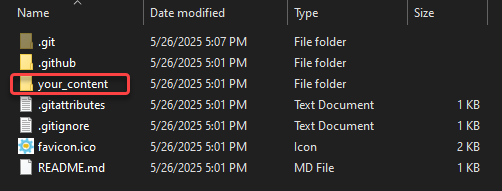
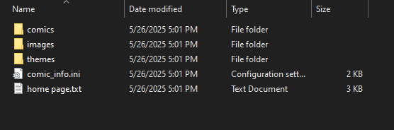

# Learning the File Structure

When uploading comic pages or making basic changes to your website in comic\_git, you only need to worry about the files in one directory of your repository: the `your_content` directory. Everything you need to do will be located in `your_content`, with the exception of [the favicon](customizing-your-website.md#adding-a-favicon-to-your-website).

<figure><figcaption></figcaption></figure>

In `your_content`, you will see the files and folders you'll need to become acquainted with to create your website.

<figure><figcaption></figcaption></figure>

## Directories

* **comics**: This is where your comic pages live, as well as the information specific to those pages. [Adding Comic Pages](adding-comic-pages.md) goes into this folder in detail.
* **images**: This is where website images that aren't tied to a specific comic page live. This includes things like a banner image, navigation link images, and whatever else you may want to use. [Customizing Your Website](customizing-your-website.md) talks about this folder in more detail.
* **themes**: This is where the actual design of your website lives. comic\_git comes with a preset theme in the default folder, but you can edit the default theme, add your own, or even add multiple that you can switch between.&#x20;
  * Editing the default theme, which is the easiest way to get started, is covered in [Customizing Your Website](customizing-your-website.md).
  * Adding your own theme is covered in [Extra Features](../additional-information/extra-features.md).
  * Changing which theme is used is covered in [Editing Your Comic Info](editing-your-comic-info.md).

## Files

* **comic\_info.ini**: This is your settings file for the website. Nearly everything that controls the behavior or configuration of your site lives in this file. [Editing Your Comic Info](editing-your-comic-info.md) covers comic\_info.ini in detail.
* **home page.txt**: This is the HTML for your comic's front page. It's in a text file to make it easier to edit, and will be converted to a proper HTML file when GitHub Pages builds your website. [Customizing Your Website](customizing-your-website.md#editing-your-comics-homepage) talks about this file more.
