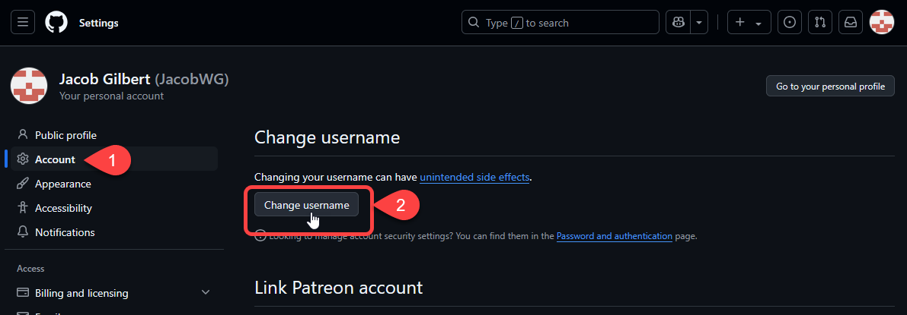

# Changing Your Website URL

## Changing your Website URL

When you create your GitHub Pages website for the first time, its URL is decided by your GitHub username, and the name of the repo you've created. For example, if your username is `JacobWG`, and you named your repo `bestcomic`, then the URL for your website will be http://JacobWG.github.io/bestcomic/.

There are two ways to change the URL for your web page:&#x20;

* Change your username/repo name
* Assign a custom domain to your website

### Changing your Username

Changing your username will change the part of the URL right before `.github.io`. It will also change the username you use to log into GitHub, and you will have to relogin to GitHub Desktop.&#x20;

To change it:

1.  Click your icon in the top right corner of any GitHub page, then click **Settings**.&#x20;

    <figure><figcaption></figcaption></figure>

    <figure><figcaption></figcaption></figure>
2. In the list of options on the left, click **Account**.&#x20;
3.  Click **Change Username**. Follow the steps GitHub gives you to complete the process.&#x20;

    <figure><figcaption></figcaption></figure>

### Changing your Repo Name

Changing the name of your webcomic's repository will change the last part of your URL.&#x20;

To change it:

1.  From the main page of your repository, click **Settings**.&#x20;

    <figure><figcaption></figcaption></figure>
2.  The first option in General Settings shows your repo name. Click in the text box, make your desired changes, then click **Rename**.&#x20;

    <figure><figcaption></figcaption></figure>

## Moving to a Custom Domain

At some point, you will likely want to host your comic from a custom domain, so your readers don't have to keep going to your github.io URL. Fortunately, GitHub Pages supports this!

### Change your GitHub Pages Settings

1.  From the main page of your repository, click **Settings**.&#x20;

    <figure><figcaption></figcaption></figure>
2.  In the list of options on the left, click **Pages**. Find the **Custom domain** entry in the Pages settings.&#x20;

    <figure><figcaption></figcaption></figure>
3.  Fill out the text field for the Custom Domain to match whatever custom domain you want to assign to your website, then click **Save**.&#x20;

    <figure><figcaption></figcaption></figure>

The page will reload with a blue banner that says `Custom domain "<domain name>" saved.`

### Create a CNAME Record for your Domain

You'll need to set up a CNAME record in the DNS settings of your domain registrar's management page. The exact instructions depend on which registrar you've registered your domain with and is beyond the scope of this article. Most registrars will have their own help documentation telling you how to do this.

GitHub provides more detail on CNAME and other DNS records and what values to enter for them. See [Managing a custom domain for your GitHub Pages site](https://docs.github.com/en/pages/configuring-a-custom-domain-for-your-github-pages-site/managing-a-custom-domain-for-your-github-pages-site).

### Create a CNAME file in your Repository

In your repository, create a new file called `CNAME` with no extension. In the file, add only a single line with your new domain, e.g. `www.bestcomic.com`

### Edit Your comic\_info.ini

Open `comic_info.ini` and add the `Comic domain` option to the `[Comic Settings]` section with your new domain as its value. Add `Comic subdirectory` as well but leave the value blank. Example below:

```
[Comic Settings]
Comic domain = www.bestcomic.com
Comic subdirectory = 
...
```

