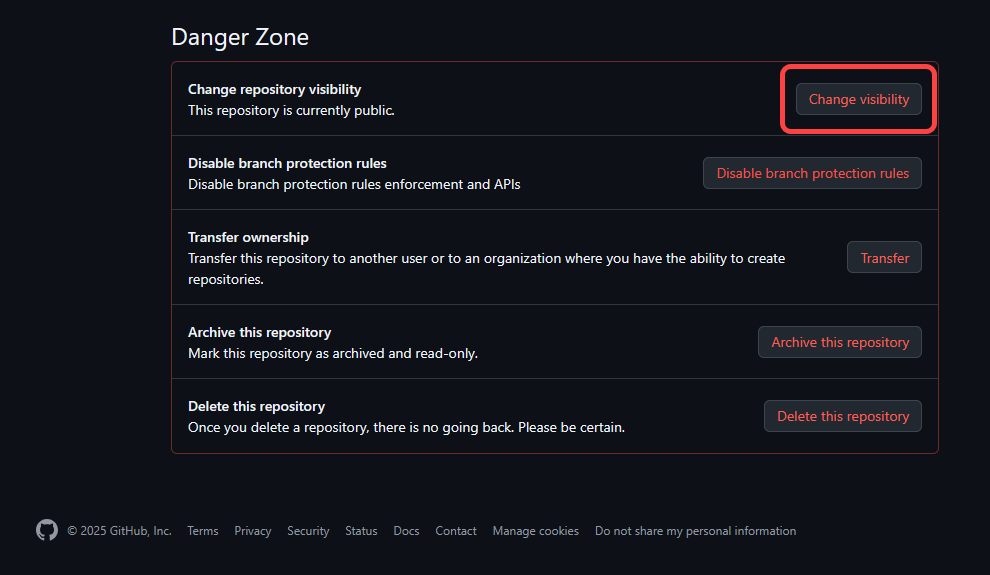
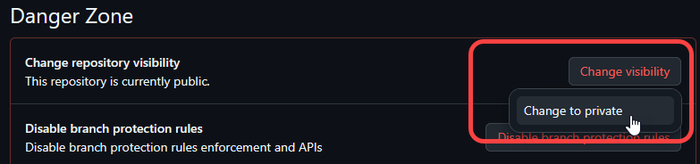
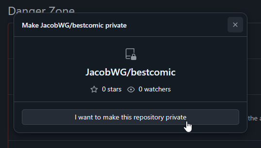
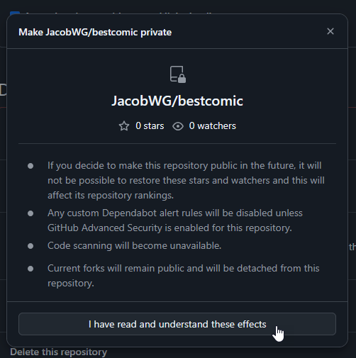
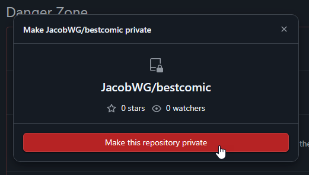

# Other Expert Tips

## Switching from a Public to a Private Repo

The main reason someone would want to make their comic\_git repository private would be to be able to schedule posts while still publishing their website to GitHub Pages. If you wish to do so, you'll need to first upgrade your account to a [GitHub Pro](https://github.com/account/upgrade) account for $4 per month.

Once you have GitHub Pro:

1. Go to your repo's **Settings** page.
2.  Scroll all the way to the bottom to the section marked **Danger Zone**, and click the **Change Visibility** button.

    <figure><figcaption></figcaption></figure>
3.  Click **Change to private**.

    <figure><figcaption></figcaption></figure>
4.  A pop-up appears asking you to confirm that you want to make the repo private. Click **I want to make this repository private**.

    <figure><figcaption></figcaption></figure>
5.  A second pop-up appears advising you of the effects of making the repo private. Click **I have read and understand these effects**.

    <figure><figcaption></figcaption></figure>
6.  The first pop-up appears again. This time, **I want to make this repository private** highlights as red. Click a final time to complete the process.

    <figure><figcaption></figcaption></figure>

You may need to re-enable GitHub Pages after making this change. Follow the [Publishing to GitHub Pages](../getting-started/publishing-to-github-pages.md) instructions to do so.

## Changing Archive Headers to Banner Images

One option creators frequently request is providing header images for their archive pages rather than the default text-only headers that come with comic\_git.

This is fortunately very easy to do! You can use CSS to replace the `<h2>` tags that represent the headers with images! For example, if you create a `Ch3.png` file in the `/your_content/images/` directory, you can replace your "Chapter 3" header with the following CSS in `stylesheet.css`:

```
#archive-section-Chapter-3 {
    display: inline-block;
    color: transparent;
    background: url("../../your_content/images/Ch3.png") no-repeat;
    background-size: contain;
    width: 100px;
    height: 100px;
}
```

You can do the same thing for the chapter link on the infinite scroll page using `#infinite-scroll-Chapter-3` instead.

For both archive sections and infinite scroll links, be sure to set `width` and `height` to match the dimensions of the image you've provided.

## Scheduled Posts

If you set the Post Date for a comic page for a future date or time (according to the Timezone you have set in your `comic_info.ini` file), comic\_git will not create that page when you push your changes to GitHub. However, the comic data (image file, `info.ini` file, etc.) are not gone, and when comic\_git runs for the first time on the date provided, the comic will be published then.

By default, comic\_git reruns every morning at 8:00 AM UTC to publish any comic posts that may have been scheduled previously. That is either 12:00 am midnight or 1:00 am Pacific Time, depending on Daylight Savings Time. If you wish to change this update schedule, you can do so by updating the following line in your `.github/workflows/main.yaml` file:

```
    - cron: '0 8 * * *'  # Runs at 8:00 AM UTC every day
```

The text `0 8 * * *` is what's called a "cron string" and it is a common way to tell computers when to perform automated tasks. This is a very powerful expression, but can be a little opaque. Fortunately, [https://crontab.guru/](https://crontab.guru/) is an excellent resource for generating the correct cron string to represent whatever update schedule you want.

Note that the cron string is processed by GitHub assuming it's in UTC time. This means the update time changes with respect to most American timezones whenever Daylight Savings Time begins or ends. Unfortunately, there's no way to change this, so it's recommended that you either pick an update time in the middle of the night where your readers won't notice if the comic uploads one hour earlier for half of the year, or change the cron string whenever Daylight Savings Time changes.


**Hiding Your Scheduled Posts**

Despite the scheduled post protection above, any scheduled posts you want to hide from the public are still available to anyone who visits your GitHub page, if they know where to look. If you wish to make your scheduled posts completely hidden from the general public, you will need to [set your repository to Private](other-expert-tips.md#switching-from-a-public-to-a-private-repo).


## The Power of Jinja2

One of the main components of the architecture of comic\_git that allows it to work as well as it does are [Jinja2 Templates](https://jinja.palletsprojects.com/en/2.11.x/templates/). Put very simply, Jinja2 templates are HTML files with extra syntax in them that act as placeholders for data that can be passed to the templates later to create a fully-fledged webpage. For example, there is a single template file that is used to create every comic page that's generated by comic\_git. The following is an excerpt from the part where the page title and post date parts of the web page are created:

```
    <div id="blurb">
        <h1 id="page-title">{{ page_title }}</h1>
        <h3 id="post-date">Posted on: {{ post_date }}</h3>
```

When the Python script that builds all the web pages runs, it passes a variable called `page_title` to the template, which gets added where `{{ page_title }}` is in that template. Same with `post_date`.

There are many other features of Jinja2 templates that make them an incredibly powerful tool for automatically building a website that I won't go into here, but if you're interested in learning about them, I highly recommend reading through the [Jinja2 documentation](https://jinja.palletsprojects.com/en/stable/templates/). The current files in comic\_git\_engine's [`templates` directory](https://github.com/comic-git/comic_git_engine/tree/latest/templates) are also commented examples of how comic_git uses Jinja.

### Template and hook data

comic_git provides structured page, image, and archive-entry objects to Jinja templates and Code Hooks. See [Template and Hook Data](template-and-hook-data.md) for the current interface.

If you want to add custom global template values, use `extra_global_values` as described in [Code Hooks](code-hooks.md).

## Adding Collaborators to your Repository

When you create your own comic\_git site for the first time, you will be the only one who can edit it at first. And if you make a private repository, you'll be the only one who will even be able to see it. If you want someone else to help you with your site, or even just to look at your GitHub Actions to help figure out why your build might have broken, you will likely need to add them as a "collaborator".

To do this, go to your Settings tab in your repository

<figure><figcaption></figcaption></figure>

Then click on Collaborators in the sidebar

<figure><figcaption></figcaption></figure>

GitHub may ask you to sign back in. After that's done, you'll be taken to the Collaborators page. To add a collaborator, click the Add People button.

<figure><figcaption></figcaption></figure>

A dialog will pop up that will let you search for a user by username, full name, or email.

<figure><figcaption></figcaption></figure>

Use any of those to find the person you want to add, and they'll show up in the list of possible users.

<figure><figcaption></figcaption></figure>

Click the name of the person you want to invite as a collaborator, then click the green "Add \<name>" button.

**WARNING:** The list of people that show up in this dropdown are pulled from the list of **ALL** GitHub users. Adding someone as collaborator gives them the ability to make changes to your website! **Make sure** the person you select is who you actually think they are!

If you accidentally add the wrong person as a collaborator, don't worry, it's easy to remove them later.

<figure><figcaption></figcaption></figure>

After clicking the "Add" button, the person you selected will show up in the list of collaborators with "Pending invite" next to their name.

<figure><figcaption></figcaption></figure>

This means GitHub has sent them an email inviting them to be a collaborator on your repo. The email will look like below:

<figure><figcaption></figcaption></figure>

That user will now need to click the "View Invitation" button, which will take them to the GitHub website, which will prompt them Accept or Decline the invitation.

<figure><figcaption></figcaption></figure>

Once they click "Accept Invitation", they'll show up as a collaborator in your Collaborators list.

<figure><figcaption></figcaption></figure>

Collaborators have full access to change and modify any code in your repository! And they'll be able to view your repository if it's set to Private. However, collaborators can **not** view or change any Settings on your repository, so you're not at risk of them deleting your repo or locking you out.

### Removing Collaborators

To remove a collaborator, simply go to the list of collaborators on your repository and click the red trashcan beside the collaborator's name.

<figure><figcaption></figcaption></figure>

GitHub will pop up a dialog asking you to confirm you want to remove this collaborator. Click the "Remove" button, and the collaborator will be removed.

<figure><figcaption></figcaption></figure>
