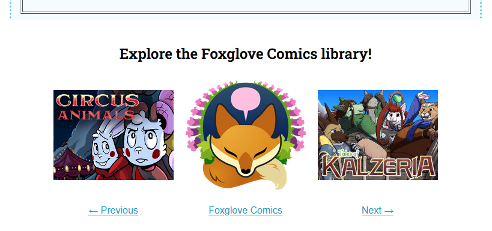

# Webring

Do you remember [webrings](https://fanlore.org/wiki/Webring)? It seemed like every Geocities page had one, back in the day. If you want that same kind of shared navigation between comics, comic_git supports it.

A comic_git webring is driven by a JSON file that lists all the comics in the ring. Each comic_git site fetches that same JSON file, figures out where its own comic is in the list, and then renders either:

- Previous / Home / Next navigation
- a full list of all webring members

<div><figure><figcaption><p>Default layout with Home</p></figcaption></figure> <figure><figcaption><p>"Show all members" with Home</p></figcaption></figure> <figure><figcaption><p>Default layout without Home</p></figcaption></figure> <figure><figcaption><p>"Show all members" without Home</p></figcaption></figure></div>

## How it works

Setting up your webring in comic_git is really simple, and only requires two steps.

### Upload webring.json


If someone else already created the webring JSON file, and you only need to connect your own comic_git site to it, you can skip ahead to [updating your comic_info.ini](webring.md#update-your-comic_infoini).


Upload a `webring.json` file to somewhere out on the publicly accessible internet. It could be Dropbox link, a file on another website, or even hosted from your own comic_git site. But it should be an absolute URL, meaning it should start with `https://`.  

This gives not only you but every website on that webring access to the same webring data.

The format for this file is in the [JSON File](webring.md#json-file) section below.

### Update your comic_info.ini

Update your `comic_info.ini` file per the [Config Options](webring.md#config-options) section below.

## JSON File

The JSON file contains the information needed for each site on the webring to build its own webring layout, all using the same data. Its structure matters, so follow the schema below. Also, all URLs in the JSON file should be absolute URLs, meaning they should start with `https://`.

### Top-level fields

<details>

<summary>version</summary>

* Required
* Value: `number`: `1`

</details>

<details>

<summary>label</summary>

* Optional
* Value: `string`
* Default: empty string

The heading shown above the webring on the site.

</details>

<details>

<summary>home</summary>

* Optional
* Value: `dictionary`
* Default: none

If defined, a link to the webring homepage will appear in the webring layout. This uses the same structure as the [Comic dictionary](webring.md#comic-dictionary) below, except that it does not need an `id`.

</details>

<details>

<summary>members</summary>

* Required
* Value: `list` of dictionaries

A list of all comics in the webring. Each item must match the [Comic dictionary](webring.md#comic-dictionary) schema below.

The order of this list defines the Previous and Next links for each comic. The list wraps around, so the first and last members connect to each other.

</details>

### Comic dictionary

<details>

<summary>id</summary>

* Required
* Value: `string`

A unique ID for the comic. This is the value comic_git uses to identify your comic inside the webring member list.

This value is **not** required for the `home` entry.

</details>

<details>

<summary>name</summary>

* Optional
* Value: `string`
* Default: empty string

The name of the comic as displayed on the website. If an `image` is defined, the image may be shown instead of the text name.

</details>

<details>

<summary>url</summary>

* Required
* Value: `string`: absolute URL

The homepage URL for the comic.

</details>

<details>

<summary>image</summary>

* Optional
* Value: `string`: absolute URL of an image file
* Default: none

If defined, the image is displayed as a link to the comic.

</details>

### Example Payload

```json
{
    "version": 1,
    "label": "Our Comics Webring!",
    "home": {
        "name": "Home",
        "url": "https://my.webring.com/",
        "image": "https://my.webring.com/icon.png"
    },
    "members": [
        {
            "id": "comic_a",
            "name": "Albert's Atrium",
            "url": "https://comic.albert.net/",
            "image": "https://comic.albert.net/icon.png"
        },
        {
            "id": "comic_b",
            "name": "Bertrand's Barn",
            "url": "https://bertrand.github.io/my_barn",
            "image": "https://bertrand.github.io/my_barn/your_content/images/webring.jpg"
        },
        {
            "id": "comic_c",
            "name": "Clara's Cliffside",
            "url": "https://clara-is-cool.neocities.org/",
            "image": "https://images.ctfassets.net/hrltx12pl8hq/7JnR6tVVwDyUM8Cbci3GtJ/bf74366cff2ba271471725d0b0ef418c/shutterstock_376532611-og.jpg"
        }
    ]
}
```

## Config Options

<details>

<summary>Enable webring</summary>

* Optional
* Value: `boolean`: `True` or `False`
* Default: `False`

If `True`, enables the webring feature. If `False`, all other options in this section are ignored.

</details>

<details>

<summary>Endpoint</summary>

* Required if `Enable webring` is `True`
* Value: `string`

The location of the webring JSON data.

In normal use, this should be an absolute URL to a remotely hosted `webring.json` file, such as:

```text
https://my.webring.com/webring.json
```

For local development, see [Local Development](webring.md#local-development).

</details>

<details>

<summary>Webring ID</summary>

* Required if `Enable webring` is `True`
* Value: `string`

A unique ID for your comic, matching the `id` field of your comic's entry in the webring JSON.

comic_git uses this value to:

- determine your Previous and Next neighbors in the webring
- identify your own comic when `Exclude own comic from members = True`

</details>

<details>

<summary>Show all members</summary>

* Optional
* Value: `boolean`: `True` or `False`
* Default: `False`

If `True`, the webring displays all members at once instead of rendering Previous and Next links.

</details>

<details>

<summary>Exclude own comic from members</summary>

* Optional
* Value: `boolean`: `True` or `False`
* Default: `False`

If `True`, your own comic will be removed from the member list shown when `Show all members = True`.

This relies on `Webring ID`, so make sure your `Webring ID` exactly matches your member entry's `id`.

</details>

### Example

```ini
[Webring]
Enable webring = True
Endpoint = https://my.webring.com/webring.json
Webring ID = comic_b
Show all members = True
Exclude own comic from members = True
```

## Local Development

If you want to test a webring locally before you have a real hosted endpoint ready, comic_git supports a special local-development mode.

Set:

```ini
[Webring]
Endpoint = local
```

When `Endpoint = local`, comic_git reads this file directly from your host repo at:

```text
your_content/webring.json
```

This mode exists only to make local development easier. Even in local mode, the `url` and `image` values inside `webring.json` should still be absolute URLs.

## Troubleshooting

### The webring does not appear at all

Check these first:

- is `Enable webring = True`
- is `Endpoint` defined
- does the build log show a webring-related error

### The build says it could not load the webring data

Check that:

- the endpoint URL is correct and publicly accessible
- if you are using `Endpoint = local`, `your_content/webring.json` exists in the host repo
- the JSON file is valid JSON

### The build says `Webring ID` is missing

`Webring ID` is required whenever the webring feature is enabled.

### The build says it could not find your `Webring ID`

Make sure your configured `Webring ID` exactly matches one member `id` in the JSON file.

Matching is exact, including capitalization and punctuation.

### `Exclude own comic from members` does not seem to work

That option relies on `Webring ID`. If your `Webring ID` does not exactly match your member entry's `id`, comic_git will not know which member is your own comic.

### Previous and Next are not the sites you expected

Previous and Next follow the order of entries in the `members` list.

The list wraps around from first to last and from last to first.
