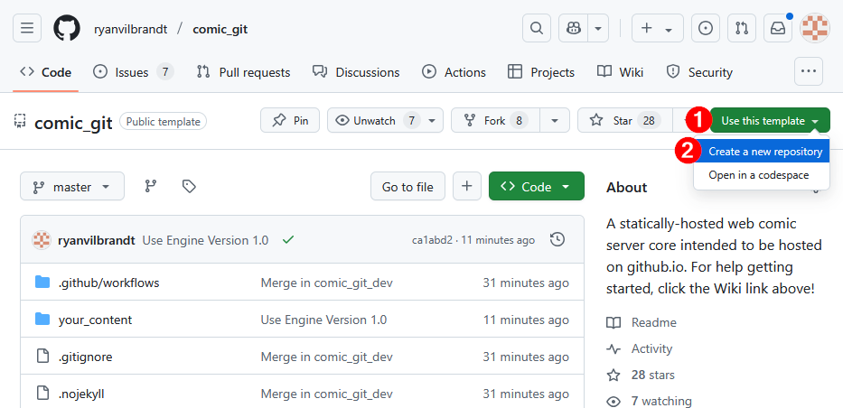

# Creating your own Repository

In this section, you'll create a copy of comic\_git in your GitHub account that you will use to make your own webcomic.


If you don't have a GitHub account, follow the instructions in [Signing Up for GitHub](signing-up-for-github.md) before proceeding.


1. Visit the comic\_git repository at [https://github.com/comic-git/comic\_git](https://github.com/comic-git/comic_git)
2.  Click **Use This Template**, then **Create a new repository**. This creates a new, independent copy of the comic\_git repository that you own. You'll use this new repository to create your webcomic.\

    
<figure><figcaption>
Create a repository from the comic_git template
</figcaption></figure>

3. GitHub will ask you some questions about the repository you're creating. Set the requested fields as follows:
   1. **Repository template**: This should already be set to `comic-git/comic_git`
   2. **Include all branches**: You can leave this box unchecked.
   3. **Owner**: This should be the username you created when signing up. If it shows something different, look into that first.
   4. **Repository name**: Choose any name you like, but we recommend the name of your comic.
   5. **Description**: This shows when viewing the GitHub repository directly, as opposed to the site you build with it. This is optional and you may leave it blank.
   6. **Public** / **Private**: This should be set to Public. GitHub requires a [GitHub Pro](https://github.com/account/upgrade) membership to use GitHub Pages with a private repository.


As with your username, the name of your repository will show up as part of your website URL. For example, if you name the repository **bestcomic**, the GitHub Pages URL would be https://comicgitdemo.github.io/**bestcomic**/


<figure><figcaption>
Making a new repository
</figcaption></figure>

4. Once you are satisfied with the settings, click **Create repository**.
5. GitHub takes a moment to generate the new repository, then displays it. You now have your own comic playground to build how you want!&#x20;

<figure><figcaption>
Your new repository!
</figcaption></figure>
