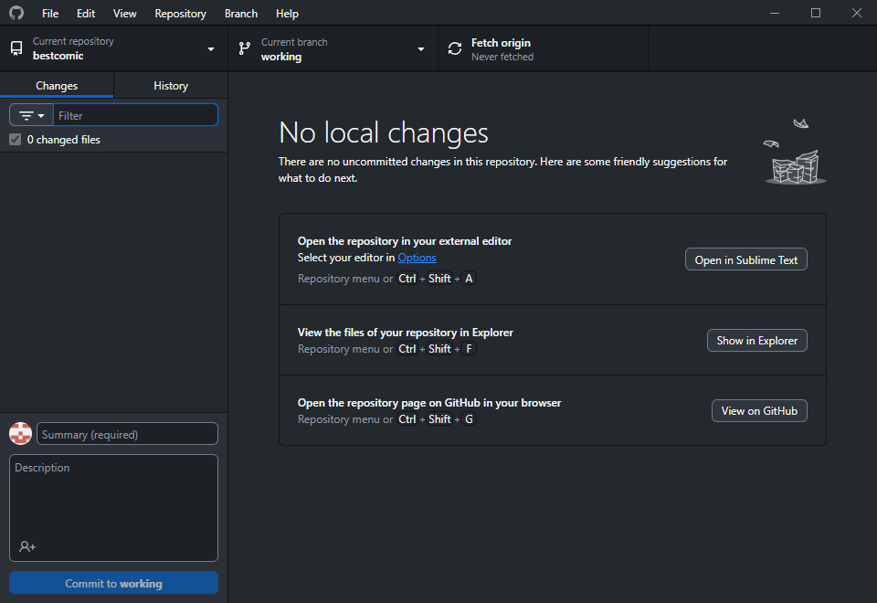

# Downloading your Files

Now that GitHub Desktop is installed, we need to download the files in the repo to your computer, which is where you'll make changes and add files.

1.  Once configured, GitHub Desktop asks you to select a repository to clone and begin using. You should see your comic repository on the left side. Click the repository, then click **Clone** at the bottom.

    <figure><figcaption>
Clone your repo.
</figcaption></figure>
2.  GitHub presents a Clone dialog. You should not need to make any changes here, but you can change the directory on your computer to install to (**Local path**) if you prefer. Once satisfied, click **Clone**.

    <figure><figcaption>
Change your local path if desired.
</figcaption></figure>
3.  GitHub Desktop will automatically download the repository to your computer. Once completed, you are presented with the main screen you'll be seeing for most of your time using GitHub Desktop.

    <figure><figcaption>
GitHub Desktop main screen.
</figcaption></figure>

That's it! You are now ready to make changes to create your own webcomic!

## Next Steps

Now that you've got the files on your computer, you can start making changes and adding comic pages. The [Basic Editing](broken-reference) section covers the fundamentals of using comic\_git and making it your own. Once you're ready to publish your changes, see [Uploading your Changes](uploading-your-changes.md).

However, if you want to experiment with changing your site right away:

1. Open the :page\_facing\_up:**comic\_info.ini** file in any text editor (Notepad works fine).
2. Change the default text in **\[Comic Info]** at the top to whatever you want.
3. Continue to [Uploading your Changes](uploading-your-changes.md) to submit the changed :page\_facing\_up:**comic\_info.ini** file and see how publishing affects the site.
