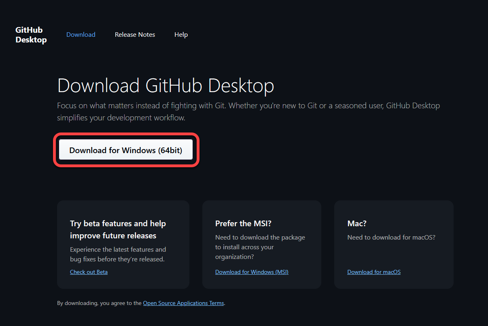
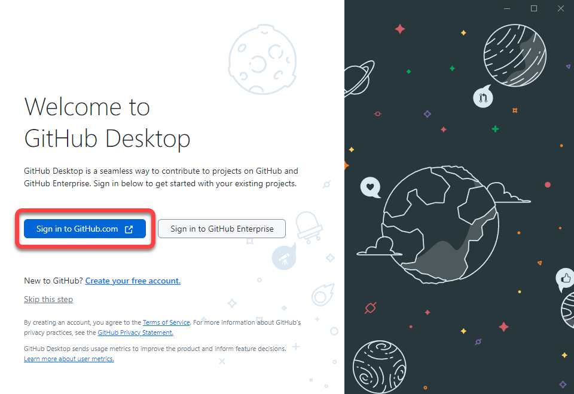
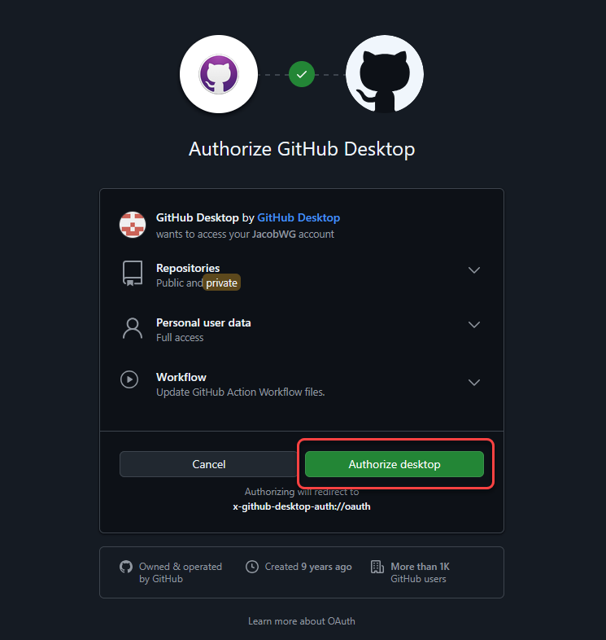
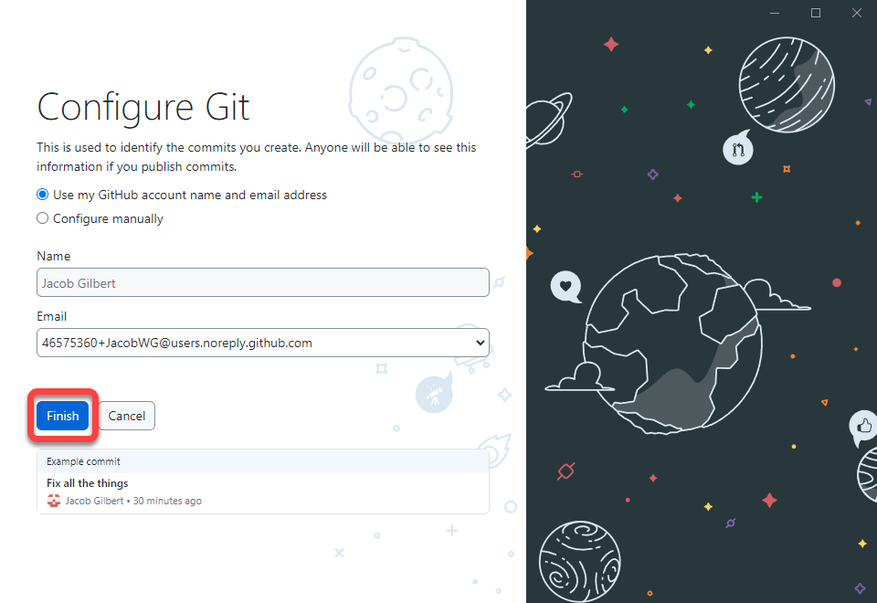

# Installing GitHub Desktop

Now that you have your own GitHub repository, how are you supposed to get to your files? The simplest method is to use GitHub Desktop.


**Git clients**

GitHub Desktop is not strictly required for comic\_git to work. If you have another git client you prefer to use, or if you want to run git from the command line, you can use that instead. The only requirement is that GitHub is used as your central repository, as many of the features comic\_git uses to function are GitHub specific.


1.  Go to the [GitHub Desktop](https://desktop.github.com/download/) website. Click the **Download** link to download the app.\

    <figure><figcaption>
Download GitHub Desktop.
</figcaption></figure>
2. Once downloaded, run the app. GitHub Desktop will automatically install and launch itself.
3.  Once GitHub Desktop has launched, the sign-in screen is displayed. Click **Sign in to GitHub**. This opens the login page in your browser window.&#x20;

    <figure><figcaption>
Welcome to GitHub Desktop.
</figcaption></figure>
4.  Once signed in, GitHub asks you to authorize GitHub Desktop to access your account information. Click **Authorize**.

    <figure><figcaption>
Authorize GitHub Desktop
</figcaption></figure>
5.  When sign-in is successful, you are asked to confirm the configure options. Change your name if desired and click **Finish**.

    <figure><figcaption>
Configure Git
</figcaption></figure>
