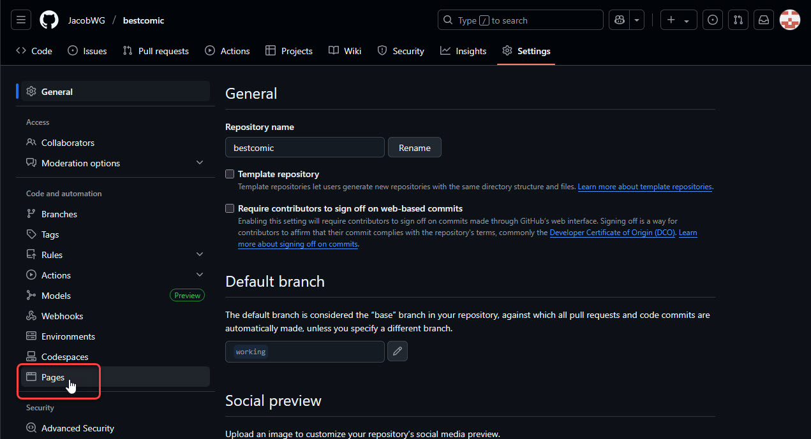

# Publishing to GitHub Pages

Once your repository is created, you can publish your comic website to GitHub Pages.


Even if you've only just created your repository from the previous page, the repo comes with some default text and images as a demonstration. Feel free to publish after creating to see how it works!


1.  In your repository, go to the **Settings** tab.&#x20;

    <figure><figcaption>
The Settings option.
</figcaption></figure>
2.  In the sidebar on the left, click **Pages**.&#x20;

    <figure><figcaption>
The Pages option.
</figcaption></figure>
3.  Under **Branch**, select `working`from the dropdown.&#x20;

    <figure><figcaption>
Select the working branch.
</figcaption></figure>


It takes a minute for the `working` branch to be created in a new repository, so if `working` isn't available in the dropdown, try refreshing the page.


4.  Click **Save**. Once you do, GitHub will automatically publish your repository to GitHub Pages!&#x20;

    
<figure><figcaption>
Click Save.
</figcaption></figure> <figure><figcaption>
Success!
</figcaption></figure>

5.  Publishing isn't immediate; GitHub needs to do some work in the background to do so. For this first time, the publishing process could take a few minutes. Go get a coffee, hit the can, call your mother... and when you come back, refresh your Settings page, and you should see a new text box appear telling you that your site is now live!&#x20;

    <figure><figcaption>
It's ready!
</figcaption></figure>


You can also view the progress of your GitHub Pages deployments by looking in the Environments section of the sidebar on your main repository page.


6.  Click **Visit site** to go to your website, hosted from your very own GitHub account! WOO HOO!&#x20;

    <figure><figcaption>
It lives!
</figcaption></figure>

Next, we need to set up the app that will let you move your own files into the repository.


## **A Tale of Two GitHub URLs**

You now have two different URLs to keep track of: Your GitHub repository URL and your GitHub Pages URL. Both of these URLs are automatically generated based on your GitHub account name and your webcomic repository name.

**Example:**

GitHub account name: **comicgitdemo** Repository name: **bestcomic**\
GitHub repository URL: https://github.com/**comicgitdemo**/**bestcomic**\
GitHub Pages URL: https://**comicgitdemo**.github.io/**bestcomic**

Your **GitHub Pages URL** is what you need to give to anyone who wants to read your comic.

If you like, you can even set a [custom domain](../additional-information/advanced-tips.md#moving-to-a-custom-domain) rather than using the default one.

