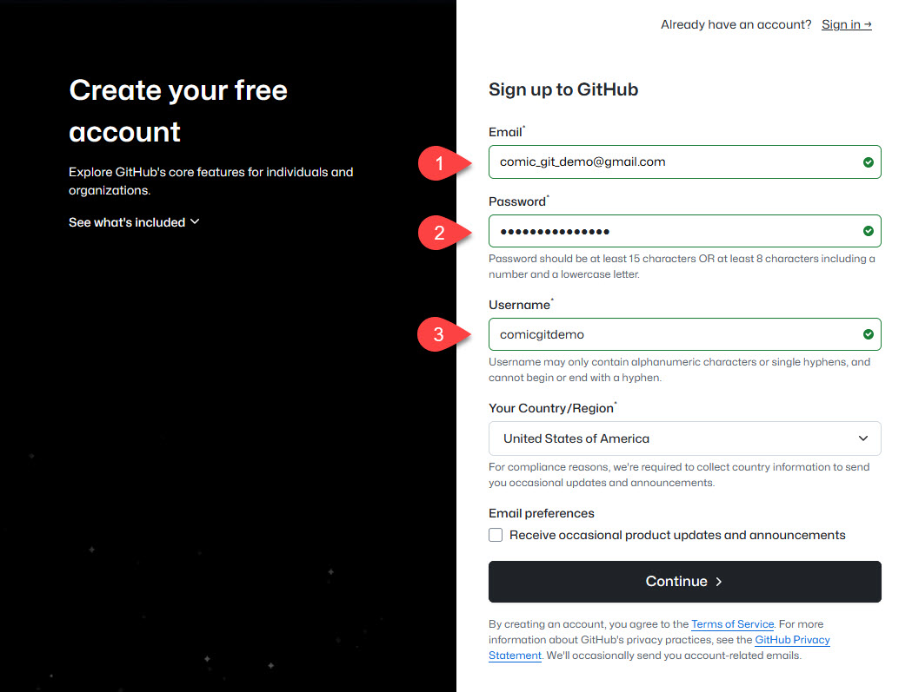

# Signing Up for GitHub

The first step in getting yourself set up with a comic\_git solution of your own is creating your own account in GitHub. If you already have an account, you may log into it and move on to [Creating your own Repository](creating-your-own-repository.md).

1. Go to [https://github.com](https://github.com).
2.  Enter your email address on the front page. Alternately, click **Sign Up** to proceed to the main sign-up page.

    <figure><figcaption>
Front page of GitHub.
</figcaption></figure>
3.  Follow GitHub's sign-up procedure.

    <figure><figcaption>
GitHub's signup page.
</figcaption></figure>


Keep in mind your username will be displayed in the URL of your webcomic. For example, if you chose the username **comicgitdemo**, your URL would start with http://**comicgitdemo**.github.io/



At some point after signing up, GitHub will send you a verification email. Make sure to verify your email address before you get to the [Uploading Your Comic](../customization/uploading-your-changes.md) section.

Due to security restrictions in GitHub, if you do not verify your email address, comic\_git will not be able to generate your website.

