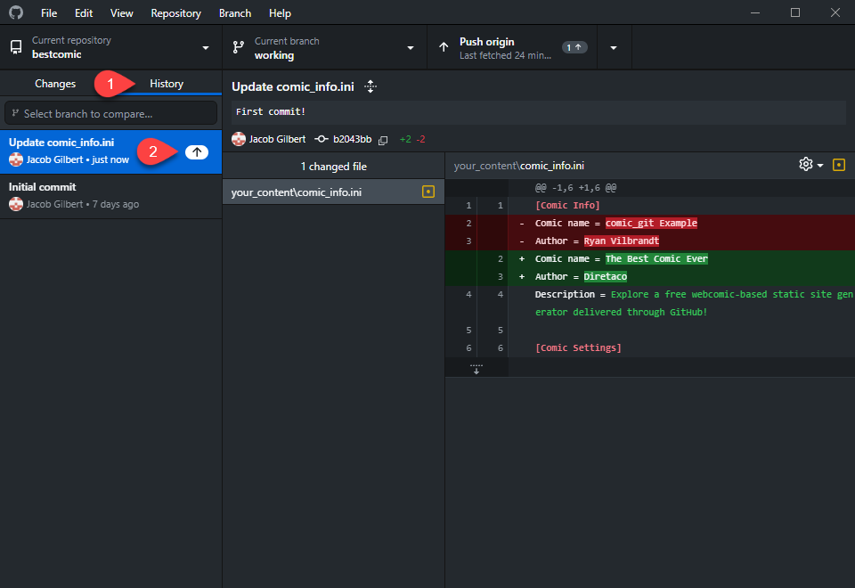

# Uploading your Changes

So you've gone through [Basic Editing](broken-reference) and made some changes to some files in your comic. Maybe you changed the comic name, or uploaded some comic files. You are ready to publish your changes to the web! This page walks you through uploading any changes you've made to GitHub.


The examples on this page assume all you've done is change the name of your comic in `comic_info.ini`. Your files will look slightly different depending on which changes you've made.


1.  Open [GitHub Desktop](installing-github-desktop.md). You should notice that the main screen looks a little different now that you've made changes to one of the files in your repository. The left column on GitHub Desktop displays which files have been added, changed, or deleted. When you select a file (in this case, there's only one), it will show you what changes were made to that file.\

    <figure><figcaption></figcaption></figure>
2. Before uploading, you need to "commit" your changes. This converts your file changes into a little packet of data called a "commit" that will be sent to GitHub. Make sure the checkboxes next to the files you want to commit are selected. You can select some or all of the files for each commit, so it's easy to split up files between different commits.


You can choose to discard any changes you didn't intend by right-clicking the changed file in the left column and clicking **Discard changes...** This will revert that particular file to the state it was before you made any changes.


3.  Type the name of the commit you're about to make in the lower left. You may name your commit anything you like. It's not used in the code anywhere, but making your commit names descriptive means you can easily look back in your history and see what you've done in the past at a glance. You may also optionally add a description.\

    <figure><figcaption></figcaption></figure>
4.  When you are satisfied, click **Commit to working**. The changes will disappear, as you have now committed those changes and they are now 'default'. (You cannot discard changes once you've committed to them.) You can go to the **History** tab to see all your past commits, including the one you just created. The up arrow next to it means it hasn't been uploaded to GitHub yet.\

    <figure><figcaption></figcaption></figure>
5.  Click **Push origin**. This is the action that actually uploads your changes to GitHub.\

    <figure><figcaption></figcaption></figure>
6.  Once complete, your website should now be updated! Go to **https://\[username].github.io/\[repo-name]/** to view your updated comic, and see that the title has been updated!\

    <figure><figcaption></figcaption></figure>

Sometimes it can take a few minutes for the changes to appear, as comic\_git is rebuilding your site with the new changes, so be patient.

If you're not sure if GitHub is doing anything, you can check the Deployments section of your repo (the [Troubleshooting](../additional-information/troubleshooting.md) section goes into more detail on this). If the page still doesn't update once the deployment finishes, you may need to clear your browser cache to see the change. The easiest way to do this is with a force refresh (Ctrl+F5), or you may need to clear the cache in your browser's settings, or even just wait a minute for the cache to expire and your browser decides to pull the new changes down.


**Publishing Changes**

Every time comic\_git runs, it regenerates your website. It runs automatically whenever you upload changes to GitHub, but it also runs every morning at 8am UTC. See [Scheduled Posts](../other-expert-tips.md#scheduled-posts) for more information.

