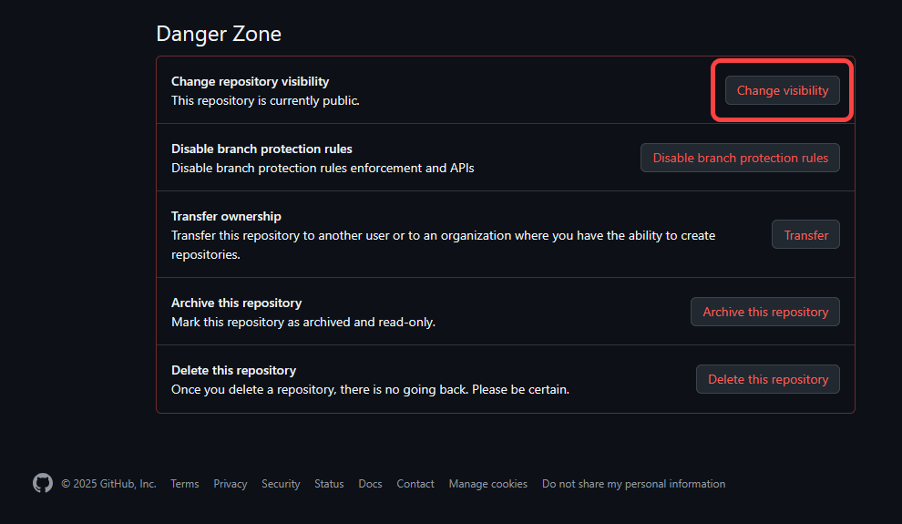
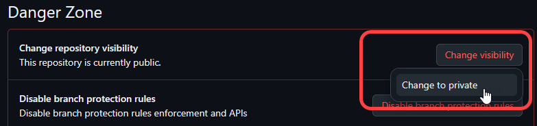
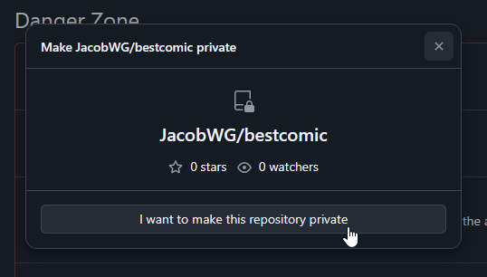
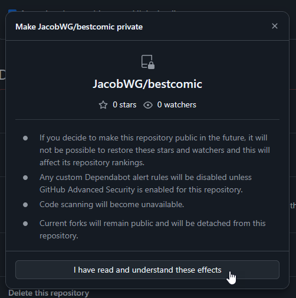
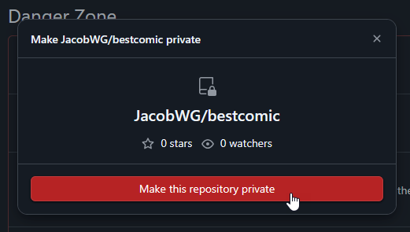

# Other Expert Tips

1. [Switching from a Public to a Private Repo](other-expert-tips.md#switching-from-a-public-to-a-private-repo)
2. [Changing Archive Headers to Banner Images](other-expert-tips.md#changing-archive-headers-to-banner-images)
3. [Scheduled Posts](other-expert-tips.md#scheduled-posts)
4. [The Power of Jinja2](other-expert-tips.md#the-power-of-jinja2)
5. [Code Hooks](other-expert-tips.md#code-hooks)

## Switching from a Public to a Private Repo

The main reason someone would want to make their comic\_git repository private would be to be able to schedule posts while still publishing their website to GitHub Pages. If you wish to do so, you'll need to first upgrade your account to a [GitHub Pro](https://github.com/account/upgrade) account for $4 per month.&#x20;

Once you have GitHub Pro:

1. Go to your repo's **Settings** page.&#x20;
2.  Scroll all the way to the bottom to the section marked **Danger Zone**, and click the **Change Visibility** button.&#x20;

    <figure><figcaption></figcaption></figure>
3.  Click **Change to private**.&#x20;

    <figure><figcaption></figcaption></figure>
4.  A pop-up appears asking you to confirm that you want to make the repo private. Click **I want to make this repository private**.&#x20;

    <figure><figcaption></figcaption></figure>
5.  A second pop-up appears advising you of the effects of making the repo private. Click **I have read and understand these effects**.&#x20;

    <figure><figcaption></figcaption></figure>
6.  The first pop-up appears again. This time, **I want to make this repository private** highlights as red. Click a final time to complete the process.&#x20;

    <figure><figcaption></figcaption></figure>

You may need to re-enable GitHub Pages after making this change. Follow the [Publishing to GitHub Pages](getting-started/publishing-to-github-pages.md) instructions to do so.

## Changing Archive Headers to Banner Images

One option creators frequently request is providing header images for their archive pages rather than the default text-only headers that come with comic\_git.

This is fortunately very easy to do! You can use CSS to replace the `<h2>` tags that represent the headers with images! For example, if you create a `Ch3.png` file in the `/your_content/images/` directory, you can replace your "Chapter 3" header with the following CSS in `stylesheet.css`:

```
#archive-section-Chapter-3 {
    display: inline-block;
    color: transparent;
    background: url("../../your_content/images/Ch3.png") no-repeat;
    background-size: contain;
    width: 100px;
    height: 100px;
}
```

You can do the same thing for the chapter link on the infinite scroll page using `#infinite-scroll-Chapter-3` instead.

For both archive sections and infinite scroll links, be sure to set `width` and `height` to match the dimensions of the image you've provided.

## Scheduled Posts

If you set the Post Date for a comic page for a future date or time (according to the Timezone you have set in your `comic_info.ini` file), comic\_git will not create that page when you push your changes to GitHub. However, the comic data (image file, `info.ini` file, etc.) are not gone, and when comic\_git runs for the first time on the date provided, the comic will be published then.

By default, comic\_git reruns every morning at 8:00 AM UTC to publish any comic posts that may have been scheduled previously. That is either 12:00 am midnight or 1:00 am Pacific Time, depending on Daylight Savings Time. If you wish to change this update schedule, you can do so by updating the following line in your `.github/workflows/main.yaml` file:

```
    - cron: '0 8 * * *'  # Runs at 8:00 AM UTC every day
```

The text `0 8 * * *` is what's called a "cron string" and it is a common way to tell computers when to perform automated tasks. This is a very powerful expression, but can be a little opaque. Fortunately, [https://crontab.guru/](https://crontab.guru/) is an excellent resource for generating the correct cron string to represent whatever update schedule you want.

Note that the cron string is processed by GitHub assuming it's in UTC time. This means the update time changes with respect to most American timezones whenever Daylight Savings Time begins or ends. Unfortunately, there's no way to change this, so it's recommended that you either pick an update time in the middle of the night where your readers won't notice if the comic uploads one hour earlier for half of the year, or change the cron string whenever Daylight Savings Time changes.


**Hiding Your Scheduled Posts**

Despite the scheduled post protection above, any scheduled posts you want to hide from the public are still available to anyone who visits your GitHub page, if they know where to look. If you wish to make your scheduled posts completely hidden from the general public, you will need to [set your repository to Private](other-expert-tips.md#switching-from-a-public-to-a-private-repo).


## The Power of Jinja2

One of the main components of the architecture of comic\_git that allows it to work as well as it does are [Jinja2 Templates](https://jinja.palletsprojects.com/en/2.11.x/templates/). Put very simply, Jinja2 templates are HTML files with extra syntax in them that act as placeholders for data that can be passed to the templates later to create a fully-fledged webpage. For example, there is a single template file that is used to create every comic page that's generated by comic\_git. The following is an excerpt from the part where the page title and post date parts of the web page are created:

```
    <div id="blurb">
        <h1 id="page-title">{{ page_title }}</h1>
        <h3 id="post-date">Posted on: {{ post_date }}</h3>
```

When the Python script that builds all the web pages runs, it passes a variable called `page_title` to the template, which gets added where `{{ page_title }}` is in that template. Same with `post_date`.

There are many other features of Jinja2 templates that make them an incredibly powerful tool for automatically building a website that I won't go into here, but if you're interested in learning about them, I highly recommend reading through the [Jinja2 documentation](https://jinja.palletsprojects.com/en/2.11.x/templates/). I have also put a lot of effort into properly commenting and describing the existing template files in the [comic\_git\_engine](https://github.com/ryanvilbrandt/comic_git_engine/tree/master/templates) `/templates/` directory to help anyone who wants look through them to figure out how comic\_git works.

### List of Values Available to Jinja2 Templates

Assuming you want to create your own Jinja2 templates (see Customizing Your Website for guidance on how to do that), it will be helpful for you to know what data the comic\_git Python script makes available to the template whenever it builds a web page. The following is a list of all variables passed to the templates as they're being built, as well as a short description of each variable. The descriptions below assume you have basic knowledge of HTML, Jinja2, and Python data structures.

* **autogenerate\_warning**: A bit of text added to the top of every file when it's created to warn comic creators against trying to edit the HTML files directly. Not very useful for any other purpose.
* **version**: The comic\_git version, e.g. 0.2.1
* **comic\_title**: The comic name, as defined in the `[Comic Info]` section of the `comic_info.ini` file.
* **comic\_author**: The comic author name, as defined in the `[Comic Info]` section of the `comic_info.ini` file.
* **comic\_description**: The comic description, as defined in the `[Comic Info]` section of the `comic_info.ini` file.
* **banner\_image**: The web path of the banner image at the top of your website, as defined in the `[Comic Settings]` section of the `comic_info.ini` file.
* **theme**: The name of the current theme that's in use.
* **comic\_url**: The URL of the homepage of your website, e.g. `https://ryanvilbrandt.github.io/comic_git/`. See [Changing Your Website URL](expert-editing/changing-your-website-url.md) for information about changing this value, or you can host your webcomic from a custom domain.
* **base\_dir**: The base directory for your comic, aka your repository name while you're hosting from a GitHub Pages URL. It is important that all URLs that reference the root directory of your website use this variable, or have the correct root directory hardcoded in the template file.
* **comic\_base\_dir**: The web path for the current comic being built. For the main comic, this will always be the same as `base_dir`, but for extra comics, the extra comic name will be added. e.g. `/base_dir/extra_comic`
* **content\_base\_dir**: The web path where the `your_content` files are stored for the current comic being built. For the main comic, this will always be the `/{base_dir}/your_content`, but for extra comics, the extra comic name will be added. e.g. `/base_dir/your_content/extra_comic`
* **links**: The list of links that make up the Links Bar on your website, partially defined by the `[Links Bar]` section of the `comic_info.ini` file. This is a list of dictionaries, each with the format `{"name": "<link name>", "url": "<link url>"}`
* **use\_images\_in\_navigation\_bar**: If `True`, comic pages will use images for the navigation icons. If `False`, text will be used. Defined in the `[Comic Settings]` section of the `comic_info.ini` file.
* **use\_thumbnails**: The boolean value of the `Use thumbnails` option, and defined in the `[Archive]` section of the `comic_info.ini` file.
* **storylines**: A dictionary of all the comics in the archive, grouped by their `Storyline` value as defined in their `info.ini` files. Any comics without a Storyline value are put into the "Uncategorized" storyline. The dictionary has the format `{"<storyline>": [<comic_dict>, <comic_dict>, <comic_dict>, ...]}`, and each comic is a dictionary of all the values comic\_git needs to build a comic page, and then some. See the next bulleted list for a description of that.
* **home\_page\_text**: The text contained in the `/your_content/home_page.txt` file. It is used by the default `index.tpl` file provided with comic\_git.
* **google\_analytics\_id**: Your Google Analytics Tracking ID, as defined in the `[Google Analytics]` section of the `comic_info.ini` file. If it's not defined, this value will be an empty string.
* **scheduled\_post\_count**: The number of comic pages you have uploaded that have Post Dates set in the future, so web pages for those comics have not been built yet. Useful for teasing your audience with extra pages. This number will always be `0` if you have the `publish_all_comics` command line argument set to `True`.
* **page\_title**: The title of the page, as defined in the `[Pages]` section of the `comic_info.ini` file. See this page for more information.

In addition to the above information, the information for the most recent comic page is also passed to every template as it's built. The values below are specific to that comic page, and can be used for things like creating a landing page that shows the first comic image or even just the title and post date. This is also the same data provided in each `comic_dict` object in the `storylines` variable, described above.

* **page\_name**: The unique identifier for the given comic page. This matches the name of the folder the comic is in, and the value in the URL for that comic page, e.g. `001` in `https://ryanvilbrandt.github.io/comic_git/comic/001/`
* **filename**: The filename for the comic image file, as defined in the comic's `info.ini` file.
* **comic\_path**: The path of the comic image file, of the format `your_content/comics/<page_name>/<filename>`.
* **thumbnail\_path**: The path to find the thumbnail of the comic image, if it exists. See [this page](https://github.com/ryanvilbrandt/comic_git/wiki/Editing-your-Comic-Info#use-thumbnails) for more information.
* **alt\_text**: The alt text of the comic, as defined in the comic's `info.ini` file.
* **first\_id**: The page\_name of the first comic on your site, sorted chronologically.
* **previous\_id**: The page\_name of the previous comic.
* **current\_id**: The page\_name of the current comic.
* **next\_id**: The page\_name of the next comic. Will usually be the same as `current_id`.
* **last\_id**: The page\_name of the latest comic. Will usually be the same as `current_id`.
* **page\_title**: The title of the comic, as defined in the comic's `info.ini` file.
* **post\_date**: The post date of the comic, as defined in the comic's `info.ini` file.
* **archive\_post\_date**: The post date of the comic, but formatted to match the "Date format" in the `[Archive]` section of the `comic_info.ini` file.
* **storyline**: The storyline of the comic, as defined in the comic's `info.ini` file. If storyline is not defined, this will be `None`.
* **characters**: A list of the comic's Characters tags, as defined in the comic's `info.ini` file.
* **tags**: A list of the comic's Tags, as defined in the comic's `info.ini` file.
* **post\_html**: The contents of the `post.txt` file for the current comic, after being run through a Markdown parser to make it pure HTML.
* **transcripts**: A dictionary of the transcripts for this comic, of the format `{"<language>": "<transcript text>"}`. See this page for more info.

If you want to add your own custom variables to the list of global variables, you can! See the next section, Code Hooks.

## Code Hooks

Some parts of comic\_git can be customized simply by editing config files or creating new templates. For complex or broader customization options, comic\_git provides Code Hooks.

In short, Code Hooks are Python functions that you can write yourself that, if present when comic\_git builds your site, will be run in the middle of site building logic. They can affect how that script runs, what values are provided to templates when they build, and more.

To add Code Hooks to your build, create a `scripts` folder inside your theme directory (if you're not using a theme, put it in the `default` theme directory). Then, copy the example file from [comic\_git\_engine](https://github.com/ryanvilbrandt/comic_git_engine/tree/master/extras), `/extras/hooks.py`, into that folder. You can edit the functions in this file to do anything you want, including calling other Python scripts elsewhere in your repository.


**Do Not Change The Working Directory**

In comic\_git, the working directory is the repository root. Please don't change this, or you risk breaking other things.


### List of available hooks

A small list of Code Hooks are supported. All of them are present in the example `hooks.py` file as well as listed below:

#### preprocess

Runs immediately after the main comic's `comic_info.ini` file is loaded. Can be used to do any setup before the comic starts to build.

#### extra\_page\_info\_processing

Runs on every info.ini file that's processed, allowing you to do further custom processing to the page info. If you return any non-null value, it will use that in place of the page info that was passed into this hook.

#### extra\_comic\_dict\_processing

Runs on every comic data dict that's processed, allowing you to do further custom processing to the dict. If you return any non-null value, it will use that in place of the comic data dict that was passed into this hook.

#### extra\_global\_values

Returns a dictionary that will be added to the global values sent to all templates when they're built. For example, if you've created a new template which programmatically displays a list of your patrons, you'll need to hook in a new variable. This is where you'd add that variable in.

#### build\_other\_pages

This function is called after all other HTML files are built. You can use this function to build whatever additional HTML files you may want, using the `utils.write_to_template()` function. Generally it's recommended that you use the Pages section of your `comic_info.ini` file to add new pages to your site. However, if you're building pages dynamically, such as separate cast pages for each character, this is where you will call it.

#### postprocess

Runs at the very end of the comic\_git build process. Can be used to do any miscellaneous cleanup you might need.


**Additional hooks**

Do you have ideas for other code hooks you'd like to see added to comic\_git? Please let me know by leaving your suggestion in the [comic\_git issues page](https://github.com/ryanvilbrandt/comic_git/issues)!


### Third-Party library support

If you're writing additional code for comic\_git, you will likely want to make use of Python's extensive third-party library options. And you can do that! But you will need to do a little more setup.

For any `hooks.py` script that makes use of additional third-party libraries above and beyond what comic\_git already uses, you'll need to create a `requirements.txt` file in the same folder. The package name for each third-party library you need should be added on a separate line in this file. For example, you can see the packages included in the base requirements file at [comic\_git\_engine's](https://github.com/ryanvilbrandt/comic_git_engine/blob/master/scripts/requirements.txt) `/scripts/requirements.txt`:

```
Jinja2
Pillow
markdown2
pytz
```

Any requirements you provide in any themes used by your main comic or extra comics will be auto-magically loaded and installed when the GitHub action is run, before the site is built. If you are not using a theme that contains a `requirements.txt` file, that file will not be loaded and the packages within it will not be installed.
